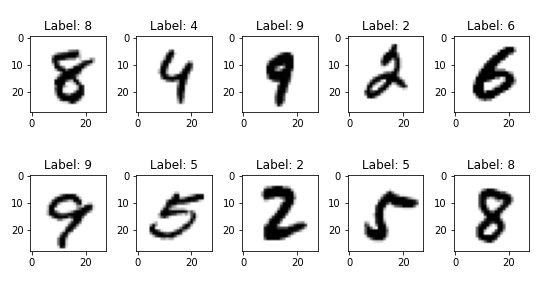

# Kernel Perceptron for Multiclass Classification using MNIST dataset

## Assignment
Digit classification with the Kernel Perceptron
Download the MNIST dataset for multiclass classification of handwritten digits. Implement the kernel Perceptron from scratch and run it to train 10 binary classifiers, one for each of the 10 digits (one-vs-all encoding), using the polynomial kernel. In order to extract a binary classifier, do the following: run the algorithm for a given number of epochs (e.g., cycles over the entire training data) on a random permutation of the training set and collect the ensemble of predictorsused by the Perceptron when predicting each training datapoint . Then use:

  + The average of the predictors in the ensemble;
  + The predictor achieving the smallest training error among those in the ensemble.

Based on the given split of the data in training and test set, evaluate the multiclass classification performance (zero-one loss) for different values of the number of epochs (go up to at least 10 epochs) and the degree of the polynomial (go up to at least degree 6). In order to use the 10 binary classifiers to make multiclass predictions, use the fact that binary classifiers trained by the Perceptron have the form =sgn(g(x))) and predict using ) where i corresponds to the binary classifier for class.

## Link to Colab
https://colab.research.google.com/drive/1eHPPsEO0D2yldjdju46_nmHMWx_8n4ep?usp=sharing
